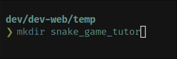
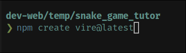
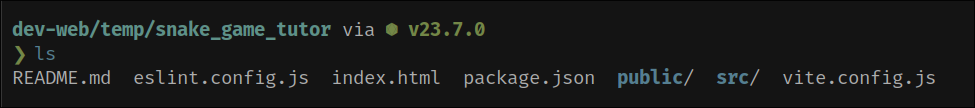
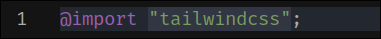
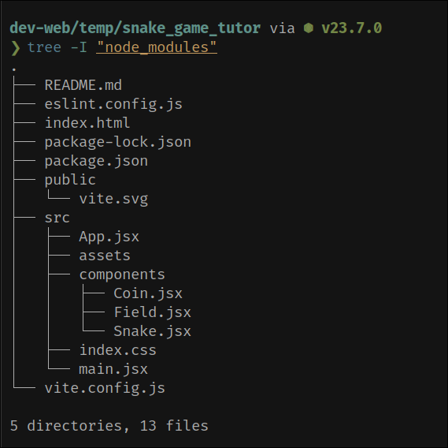
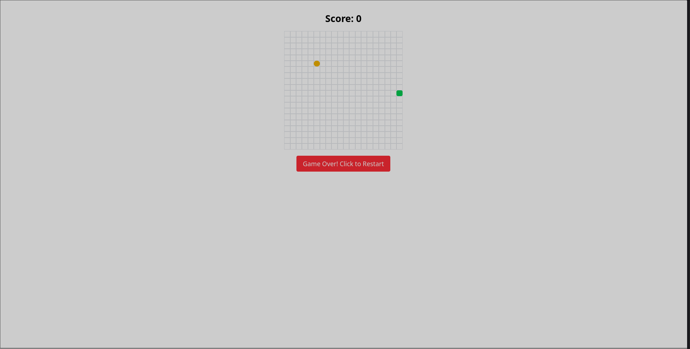

# Snake Game React Implementation

<div align="center">

[](https://github.com/ZakariaElKhaldi/simple_snake_game)
[](https://reactjs.org/)
[](https://vitejs.dev/)
[](https://tailwindcss.com/)
[](LICENSE)

A modern implementation of the classic Snake game using React, Vite, and Tailwind CSS.

[View Demo](https://github.com/ZakariaElKhaldi/simple_snake_game) • [Report Bug](https://github.com/ZakariaElKhaldi/simple_snake_game/issues) • [Request Feature](https://github.com/ZakariaElKhaldi/simple_snake_game/issues)


<br>
<em>Final Game Preview with Styling</em>

</div>

## 📋 Table of Contents
1. [Features](#-features)
2. [Quick Start](#-quick-start)
3. [Step-by-Step Guide](#-step-by-step-guide)
4. [Game Implementation](#-game-implementation)
5. [Styling & Animation](#-styling--animation)
6. [Contributing](#-contributing)
7. [License](#-license)

## 🌟 Features

- 🐍 Classic snake gameplay with modern visuals
- 🎯 Score tracking and game over system
- 🎨 Sleek UI with Tailwind CSS
- ⚡ Fast development with Vite
- 🎮 Smooth controls and animations
- 📱 Responsive design

## 🚀 Quick Start

```bash
# Clone the repository
git clone https://github.com/ZakariaElKhaldi/simple_snake_game.git

# Navigate to project directory
cd simple_snake_game

# Install dependencies
npm install

# Start development server
npm run dev
```

Visit `http://localhost:3000` to play the game!

## 📖 Step-by-Step Guide

### 1. Initial Project Setup

<div align="center">
  <table>
    <tr>
      <td align="center">
        
        <br>
        <em>1. Create project directory</em>
      </td>
      <td align="center">
        
        <br>
        <em>2. Start Vite project creation</em>
      </td>
    </tr>
    <tr>
      <td align="center">
        
        <br>
        <em>3. Select React template</em>
      </td>
      <td align="center">
        
        <br>
        <em>4. Choose JavaScript variant</em>
      </td>
    </tr>
  </table>
</div>

### 2. Project Configuration

<div align="center">
  <table>
    <tr>
      <td align="center">
        
        <br>
        <em>5. Initial project structure</em>
      </td>
      <td align="center">
        
        <br>
        <em>6. Navigate to project directory</em>
      </td>
    </tr>
  </table>
</div>

### 3. Tailwind CSS Setup

<div align="center">
  <table>
    <tr>
      <td align="center">
        
        <br>
        <em>7. Install Tailwind CSS</em>
      </td>
      <td align="center">
        
        <br>
        <em>8. Configure Tailwind in index.css</em>
      </td>
    </tr>
    <tr>
      <td align="center">
        
        <br>
        <em>9. Vite config before Tailwind</em>
      </td>
      <td align="center">
        
        <br>
        <em>10. Vite config after Tailwind</em>
      </td>
    </tr>
  </table>
</div>

### 4. Project Structure and Components

<div align="center">
  <table>
    <tr>
      <td align="center">
        
        <br>
        <em>11. Organized component structure</em>
      </td>
      <td align="center">
        
        <br>
        <em>12. Basic implementation before styling</em>
      </td>
    </tr>
  </table>
</div>

### 5. Final Implementation

<div align="center">
  <table>
    <tr>
      <td align="center">
        
        <br>
        <em>13. Game implementation before styling</em>
      </td>
      <td align="center">
        
        <br>
        <em>14. Final styled implementation</em>
      </td>
    </tr>
  </table>
</div>

## 🎮 Game Implementation

### Core Game Logic

```jsx
// Game constants and state
const GRID_SIZE = 20;
const CELL_SIZE = 15;

const [snake, setSnake] = useState([{ x: 10, y: 10 }]);
const [direction, setDirection] = useState('RIGHT');
const [score, setScore] = useState(0);
```

## 💻 Code Breakdown

### Main App Component (App.jsx)
```jsx
// Key game state management
const [snake, setSnake] = useState([{ x: 10, y: 10 }]);  // Snake body positions
const [coin, setCoin] = useState({ x: 5, y: 5 });        // Coin position
const [direction, setDirection] = useState('RIGHT');      // Current direction
const [gameOver, setGameOver] = useState(false);         // Game state
const [score, setScore] = useState(0);                   // Player score

// Keyboard controls
useEffect(() => {
   const handleKeyPress = (e) => {
      switch (e.key) {
         case 'ArrowUp': if (direction !== 'DOWN') setDirection('UP'); break;
         case 'ArrowDown': if (direction !== 'UP') setDirection('DOWN'); break;
         case 'ArrowLeft': if (direction !== 'RIGHT') setDirection('LEFT'); break;
         case 'ArrowRight': if (direction !== 'LEFT') setDirection('RIGHT'); break;
      }
   };
   // ... event listener setup
});

// Game loop implementation
useEffect(() => {
   if (gameOver) return;
   const moveSnake = () => {
      const newSnake = [...snake];
      const head = { ...newSnake[0] };
      // Move head based on direction
      // Check collisions
      // Handle coin collection
      setSnake(newSnake);
   };
   const gameInterval = setInterval(moveSnake, 150);
   return () => clearInterval(gameInterval);
}, [snake, direction, coin, gameOver, score]);
```

### Field Component (Field.jsx)
```jsx
const Field = ({ gridSize, cellSize }) => {
   const cells = [];
   // Create grid cells
   for (let y = 0; y < gridSize; y++) {
      for (let x = 0; x < gridSize; x++) {
         cells.push(
            <div
               key={`${x}-${y}`}
               className="absolute border border-gray-600 bg-gray-800/50"
               style={{
                  left: x * cellSize,
                  top: y * cellSize,
                  width: cellSize,
                  height: cellSize,
               }}
            />
         );
      }
   }
   return <div className="relative rounded-lg overflow-hidden">{cells}</div>;
};
```
Key features:
- Creates game grid using absolute positioning
- Handles grid cell styling
- Maintains game boundaries

### Snake Component (Snake.jsx)
```jsx
const Snake = ({ segments, cellSize }) => {
   return segments.map((segment, index) => {
      const isHead = index === 0;
      return (
         <div
            key={index}
            className={`absolute ${isHead ? 'bg-green-400' : 'bg-green-500'} 
                       rounded-sm transform transition-all duration-100
                       shadow-lg ${isHead ? 'scale-105' : ''}`}
            style={{
               left: segment.x * cellSize,
               top: segment.y * cellSize,
               width: cellSize,
               height: cellSize,
               zIndex: isHead ? 3 : 2,
            }}
         />
      );
   });
};
```
Key features:
- Renders snake segments with different styling for head
- Handles smooth movement transitions
- Implements visual effects for better UX

### Coin Component (Coin.jsx)
```jsx
const Coin = ({ position, cellSize }) => {
   return (
      <div
         className="absolute bg-yellow-400 rounded-full transform 
                    animate-pulse shadow-lg shadow-yellow-400/50
                    border-2 border-yellow-300"
         style={{
            left: position.x * cellSize,
            top: position.y * cellSize,
            width: cellSize,
            height: cellSize,
            zIndex: 2,
         }}
      />
   );
};
```
Key features:
- Renders collectible coin
- Implements pulsing animation
- Adds visual effects for better visibility

### Key Game Mechanics

1. **Snake Movement**
   ```jsx
   // Update head position based on direction
   switch (direction) {
      case 'UP': head.y -= 1; break;
      case 'DOWN': head.y += 1; break;
      case 'LEFT': head.x -= 1; break;
      case 'RIGHT': head.x += 1; break;
   }
   ```

2. **Collision Detection**
   ```jsx
   // Wall collision
   if (head.x < 0 || head.x >= GRID_SIZE || head.y < 0 || head.y >= GRID_SIZE) {
      setGameOver(true);
      return;
   }

   // Self collision
   if (newSnake.some(segment => segment.x === head.x && segment.y === head.y)) {
      setGameOver(true);
      return;
   }
   ```

3. **Coin Collection**
   ```jsx
   if (head.x === coin.x && head.y === coin.y) {
      setScore(score + 1);
      generateNewCoin();
   } else {
      newSnake.pop(); // Remove tail if no coin collected
   }
   ```

## 🎨 Styling & Animation

### Visual Design
```jsx
// Dark theme container
<div className="min-h-screen bg-gradient-to-b from-gray-900 to-gray-800">
  {/* Game content */}
</div>

// Game board
<div className="relative bg-gray-700 rounded-lg p-4 shadow-2xl">
  {/* Game components */}
</div>
```

### Animations
```jsx
// Snake movement
className={`transform transition-all duration-100`}

// Coin effect
className="animate-pulse shadow-lg shadow-yellow-400/50"

// Button interactions
className="transform hover:scale-105 transition-transform duration-200"
```

## 🤝 Contributing

1. Fork the Project
2. Create your Feature Branch (`git checkout -b feature/AmazingFeature`)
3. Commit your Changes (`git commit -m 'Add some AmazingFeature'`)
4. Push to the Branch (`git push origin feature/AmazingFeature`)
5. Open a Pull Request

## 📄 License

Distributed under the MIT License. See `LICENSE` for more information.

## 🙏 Acknowledgments

* [React](https://reactjs.org/)
* [Vite](https://vitejs.dev/)
* [Tailwind CSS](https://tailwindcss.com/)
