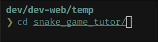
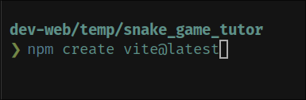
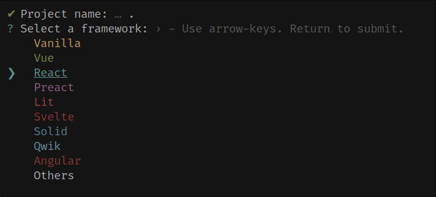
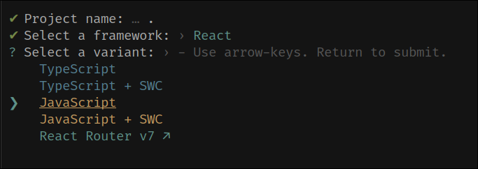
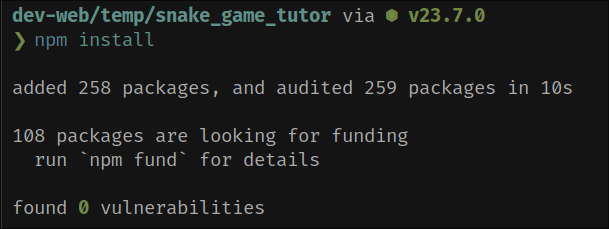
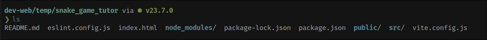

# Snake Game React Implementation

A modern implementation of the classic Snake game using React, Vite, and Tailwind CSS.

## Table of Contents
1. [Project Setup](#project-setup)
2. [Project Structure](#project-structure)
3. [Game Implementation](#game-implementation)
4. [Styling and Animations](#styling-and-animations)
5. [Game Features](#game-features)
6. [Development Guide](#development-guide)

## Project Setup

### 1. Initial Setup

1. **Create Vite Project**
   
   ```bash
   npm create vite@latest
   ```
   - Run the command above to start a new project
   - Follow the prompts to set up your project

2. **Project Configuration**
   
   - Choose React as your framework
   - Select JavaScript as the variant

3. **Install Dependencies**
   
   ```bash
   cd your-project-name
   npm install
   ```

### 2. Tailwind CSS Setup

1. **Install Tailwind**
   
   ```bash
   npm install -D tailwindcss postcss autoprefixer
   npx tailwindcss init -p
   ```

2. **Configure Tailwind**
   
   - Update `tailwind.config.js`:
   ```js
   module.exports = {
     content: ["./src/**/*.{js,jsx}"],
     theme: {
       extend: {},
     },
     plugins: [],
   }
   ```
   - Add Tailwind directives to your CSS

## Project Structure

### 1. Component Organization


```
src/
├── components/
│   ├── Field.jsx
│   ├── Snake.jsx
│   └── Coin.jsx
├── App.jsx
└── main.jsx
```

### 2. Component Overview

1. **Main App Component (`App.jsx`)**
   - Game state management
   - Core game logic
   - Event handling

2. **Game Components**
   
   - `Field.jsx`: Game board rendering
   - `Snake.jsx`: Snake segments rendering
   - `Coin.jsx`: Collectible item rendering

## Game Implementation

### 1. Core Game Logic

```jsx
// Key game constants
const GRID_SIZE = 20;
const CELL_SIZE = 15;

// State management
const [snake, setSnake] = useState([{ x: 10, y: 10 }]);
const [coin, setCoin] = useState({ x: 5, y: 5 });
const [direction, setDirection] = useState('RIGHT');
const [gameOver, setGameOver] = useState(false);
const [score, setScore] = useState(0);
```

### 2. Game Mechanics


1. **Snake Movement**
   
   - Arrow key controls
   - Collision detection
   - Movement restrictions

2. **Coin Collection**
   
   - Random placement
   - Score increment
   - Snake growth

3. **Game Over Logic**
   
   - Wall collision
   - Self collision
   - Restart functionality

## Styling and Animations

### 1. Visual Design


1. **Layout**
   ```jsx
   <div className="min-h-screen bg-gradient-to-b from-gray-900 to-gray-800">
   ```
   - Dark theme
   - Responsive design
   - Centered layout

2. **Game Board**
   ```jsx
   <div className="relative bg-gray-700 rounded-lg p-4 shadow-2xl">
   ```
   - Dark container
   - Shadow effects
   - Rounded corners

### 2. Animations

1. **Snake Movement**
   ```jsx
   className={`transform transition-all duration-100`}
   ```
   - Smooth transitions
   - Hardware acceleration
   - Fluid segment following

2. **Coin Effects**
   ```jsx
   className="animate-pulse shadow-lg shadow-yellow-400/50"
   ```
   - Pulsing animation
   - Glowing effect
   - Attention-grabbing

3. **UI Interactions**
   ```jsx
   className="transform hover:scale-105 transition-transform duration-200"
   ```
   - Hover effects
   - Smooth transitions
   - Visual feedback

### 3. Performance

- Hardware-accelerated animations
- Optimized rendering
- Efficient state updates

## Game Features

1. **Core Mechanics**
   - Grid-based movement
   - Score tracking
   - Collision detection

2. **User Interface**
   - Score display
   - Game over screen
   - Control instructions

3. **Enhanced Experience**
   - Smooth animations
   - Visual feedback
   - Responsive controls

## Development Guide

### Running the Project
```bash
# Install dependencies
npm install

# Start development server
npm run dev
```

The game will be available at `http://localhost:3000`

### Development Tools
- Vite for fast development
- React for UI components
- Tailwind CSS for styling
- Modern ES6+ JavaScript
